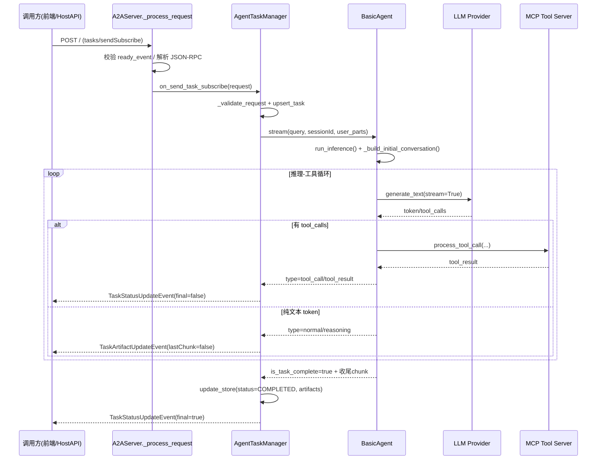

# A2A (Agent-to-Agent) 框架架构与落地规划文档

## 1. A2A 框架在本项目中的体现

A2A（Agent-to-Agent）是一种让智能体之间能够通过标准化协议进行通信、协作的架构。在本项目 `A2AServer` 中，该框架主要体现在以下几个层面：

### 1.1 分布式微服务架构

每个 Agent 都是一个独立的微服务容器，通过 Docker 进行编排。

- **Health Advisor (健康顾问)**: 负责综合诊断、回答用户咨询。
- **Health Records (健康档案)**: 负责管理 OCR 识别后的病历、体检报告，提供 RAG 检索能力。
- **Medication Reminder (用药提醒)**: 负责解析处方，生成定时提醒任务。
- **Visit Summary (就诊总结)**: 负责生成病历摘要。

**体现位置**:

- `docker-compose.yml`: 定义了各个 Agent 的服务名称（如 `health_advisor`, `health_records`）和端口。
- `backend/A2AServer`: 提供了 Agent 的基类 (`BasicAgent`) 和通信协议 (`A2AServer`)。

### 1.2 标准化通信协议 (JSON-RPC)

Agent 之间不直接调用函数，而是通过 HTTP 发送符合 JSON-RPC 2.0 规范的消息。

- **发现机制**: 每个 Agent 都有一个 `/.well-known/agent.json` 端点，暴露自己的能力（Capabilities）和工具（Tools）。
- **交互方式**: Agent A 通过 POST 请求发送 `tasks/send` 指令给 Agent B。
  - 例如：`Health Advisor` 需要查询病历时，会发送一个 Task 给 `Health Records` Agent，要求其执行 "search_medical_records" 工具。

**代码体现**:

- `backend/HealthAdvisor/mcpserver/a2a_integration_tool.py`: 封装了 `_send_task` 方法，实现了对其他 Agent 的远程调用。

### 1.3 智能体协作流

目前项目中的协作流主要由 **Health Advisor** 发起：

1.  用户询问：“我最近的血常规报告有什么异常？”
2.  **Health Advisor** 接收请求。
3.  **Health Advisor** 识别到需要查阅档案，通过 A2A 协议调用 **Health Records** Agent。
4.  **Health Records** 执行 RAG 检索，返回相关文档片段。
5.  **Health Advisor** 综合信息，生成最终回答。

---

## 2. 功能缺失与待落地清单

尽管框架已搭建完毕，但仍有一些产品化与工程化能力需要补齐。以下是急需落地的功能：

### 2.1 知识库管理 (RAG Management)

- **现状**: 仅支持通过 API 删除文档，且只能通过搜索间接找到文档。
- **缺失**:
  - **可视化上传**: 缺乏直接拖拽 PDF/图片上传的界面。
  - **文档解析状态**: 无法看到文档正在 OCR 处理中还是 Embedding 中。
- **计划**: 在 Admin Dashboard 的 "KNOWLEDGE BASE" 增加上传组件和处理队列状态栏。

### 2.2 真实监控与告警

- **现状**: Admin Dashboard 的 "AGENT STATUS" 仅检测端口是否通。
- **缺失**:
  - **业务健康度**: 无法知道 Agent 是否因为 API Key 过期或模型额度不足而无法响应。
  - **延迟监控**: 没有展示 Agent 的平均响应时间。
- **计划**: 集成 Prometheus 或在 `admin_backend` 实现更深度的 `/health/deep` 检测接口。

### 2.3 OCR 与多用户支持

- **现状**: 单用户，OCR 引擎配置在环境变量。
- **缺失**:
  - **多用户切换**: 无法为家庭不同成员建立隔离的档案。
  - **OCR 调试工具**: 无法在界面上直接测试一张图片的 OCR 效果并校对。

---

## 3. 如何在项目中使用 A2A 框架

如果您想扩展本项目，增加一个新的 Agent（例如“饮食顾问”），请遵循以下步骤：

### 步骤 1: 创建 Agent 目录

在 `backend/` 下新建 `DietAdvisor` 目录，参考 `HealthAdvisor` 的结构：

```
backend/DietAdvisor/
├── main.py             # 入口文件，定义 Server 和 Port
├── mcp_config.json     # 定义该 Agent 拥有的工具（如查询食物热量）
├── prompt.txt          # 定义 Agent 的人设（"你是一个资深营养师..."）
└── mcpserver/          # 具体的 Python 工具代码
```

### 步骤 2: 定义工具 (MCP Tools)

在 `mcpserver/` 中编写 Python 函数，使用 `@mcp.tool()` 装饰器注册工具。例如 `search_food_calories(food_name: str)`。

### 步骤 3: 注册到 Docker 网络

在 `docker-compose.yml` 中添加服务：

```yaml
diet_advisor:
  build:
    context: backend/DietAdvisor
  ports:
    - "10014:10014"
  environment:
    - PORT=10014
```

### 步骤 4: 实现交互 (A2A)

如果 `Health Advisor` 需要咨询 `Diet Advisor`：

1.  在 `HealthAdvisor/mcp_config.json` 中添加对 `diet_advisor` 的描述。
2.  在 `HealthAdvisor/prompt.txt` 中告诉它：“当用户问及饮食建议时，请调用 Diet Advisor 工具”。
3.  复用 `a2a_integration_tool.py` 中的逻辑，使其能向 `http://diet_advisor:10014` 发送任务。

### 步骤 5: 监控与管理

在 `admin_backend` 的监控列表中添加 `diet_advisor` 的地址，即可在未来的科技风仪表盘中看到它的状态。

---

## 4. 请求执行时序（tasks/sendSubscribe）

以下时序对应当前代码实现，便于排障与二次开发：



### 4.1 核心代码定位

- 请求入口与分发：`backend/A2AServer/src/A2AServer/common/server/server.py`
- 流式任务主链路：`backend/A2AServer/src/A2AServer/task_manager.py`
- Agent 推理与工具回环：`backend/A2AServer/src/A2AServer/agent.py`
- MCP 工具调用执行：`backend/A2AServer/src/A2AServer/mcp_client/client.py`

### 4.2 异常兜底说明

- 在 `task_manager.py` 的流式循环末尾，使用 `except Exception as e` 将异常统一转为 `InternalError` 的 JSON-RPC 返回。
- 该设计能保证 SSE 链路尽量不断开，但具体故障原因需结合日志中的 traceback 定位。
