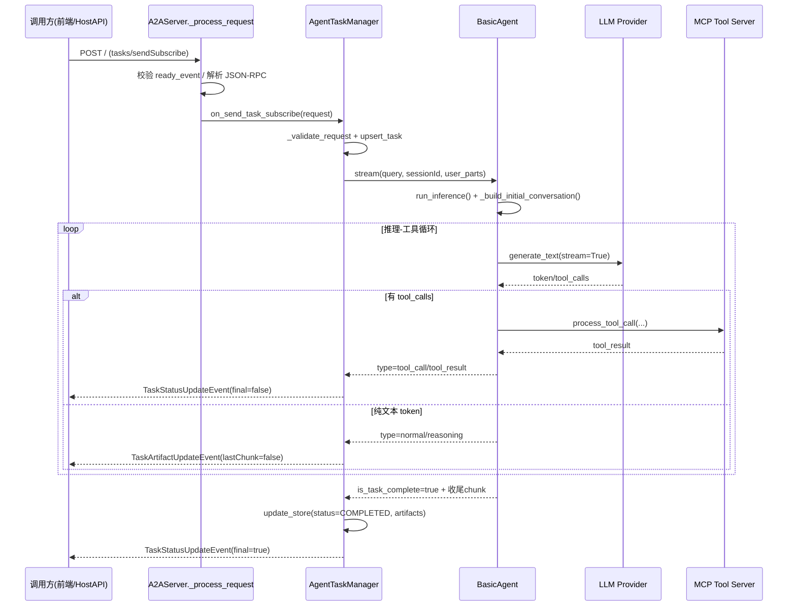

# A2A (Agent-to-Agent) 框架架构与落地规划文档

## 1. A2A 框架在本项目中的体现

A2A（Agent-to-Agent）是一种让智能体之间能够通过标准化协议进行通信、协作的架构。在本项目 `A2AServer` 中，该框架主要体现在以下几个层面：

### 1.1 分布式微服务架构

每个 Agent 都是一个独立的微服务容器，通过 Docker 进行编排。

- **Health Advisor (健康顾问)**: 负责综合诊断、回答用户咨询。
- **Health Records (健康档案)**: 负责管理 OCR 识别后的病历、体检报告，提供 RAG 检索能力。
- **Medication Reminder (用药提醒)**: 负责解析处方，生成定时提醒任务。
- **Visit Summary (就诊总结)**: 负责生成病历摘要。

**体现位置**:

- `docker-compose.yml`: 定义了各个 Agent 的服务名称（如 `health_advisor`, `health_records`）和端口。
- `backend/A2AServer`: 提供了 Agent 的基类 (`BasicAgent`) 和通信协议 (`A2AServer`)。

### 1.2 标准化通信协议 (JSON-RPC)

Agent 之间不直接调用函数，而是通过 HTTP 发送符合 JSON-RPC 2.0 规范的消息。

- **发现机制**: 每个 Agent 都有一个 `/.well-known/agent.json` 端点，暴露自己的能力（Capabilities）和工具（Tools）。
- **交互方式**: Agent A 通过 POST 请求发送 `tasks/send` 指令给 Agent B。
  - 例如：`Health Advisor` 需要查询病历时，会发送一个 Task 给 `Health Records` Agent，要求其执行 "search_medical_records" 工具。

**代码体现**:

- `backend/HealthAdvisor/mcpserver/a2a_integration_tool.py`: 封装了 `_send_task` 方法，实现了对其他 Agent 的远程调用。

### 1.3 智能体协作流

目前项目中的协作流主要由 **Health Advisor** 发起：

1.  用户询问：“我最近的血常规报告有什么异常？”
2.  **Health Advisor** 接收请求。
3.  **Health Advisor** 识别到需要查阅档案，通过 A2A 协议调用 **Health Records** Agent。
4.  **Health Records** 执行 RAG 检索，返回相关文档片段。
5.  **Health Advisor** 综合信息，生成最终回答。

---

## 2. 功能缺失与待落地清单

尽管框架已搭建完毕，但仍有一些产品化与工程化能力需要补齐。以下是急需落地的功能：

### 2.1 知识库管理 (RAG Management)

- **现状**: 仅支持通过 API 删除文档，且只能通过搜索间接找到文档。
- **缺失**:
  - **可视化上传**: 缺乏直接拖拽 PDF/图片上传的界面。
  - **文档解析状态**: 无法看到文档正在 OCR 处理中还是 Embedding 中。
- **计划**: 在 Admin Dashboard 的 "KNOWLEDGE BASE" 增加上传组件和处理队列状态栏。

### 2.2 真实监控与告警

- **现状**: Admin Dashboard 的 "AGENT STATUS" 仅检测端口是否通。
- **缺失**:
  - **业务健康度**: 无法知道 Agent 是否因为 API Key 过期或模型额度不足而无法响应。
  - **延迟监控**: 没有展示 Agent 的平均响应时间。
- **计划**: 集成 Prometheus 或在 `admin_backend` 实现更深度的 `/health/deep` 检测接口。

### 2.3 OCR 与多用户支持

- **现状**: 单用户，OCR 引擎配置在环境变量。
- **缺失**:
  - **多用户切换**: 无法为家庭不同成员建立隔离的档案。
  - **OCR 调试工具**: 无法在界面上直接测试一张图片的 OCR 效果并校对。

---

## 3. 如何在项目中使用 A2A 框架

如果您想扩展本项目，增加一个新的 Agent（例如“饮食顾问”），请遵循以下步骤：

### 步骤 1: 创建 Agent 目录

在 `backend/` 下新建 `DietAdvisor` 目录，参考 `HealthAdvisor` 的结构：

```
backend/DietAdvisor/
├── main.py             # 入口文件，定义 Server 和 Port
├── mcp_config.json     # 定义该 Agent 拥有的工具（如查询食物热量）
├── prompt.txt          # 定义 Agent 的人设（"你是一个资深营养师..."）
└── mcpserver/          # 具体的 Python 工具代码
```

### 步骤 2: 定义工具 (MCP Tools)

在 `mcpserver/` 中编写 Python 函数，使用 `@mcp.tool()` 装饰器注册工具。例如 `search_food_calories(food_name: str)`。

### 步骤 3: 注册到 Docker 网络

在 `docker-compose.yml` 中添加服务：

```yaml
diet_advisor:
  build:
    context: backend/DietAdvisor
  ports:
    - "10014:10014"
  environment:
    - PORT=10014
```

### 步骤 4: 实现交互 (A2A)

如果 `Health Advisor` 需要咨询 `Diet Advisor`：

1.  在 `HealthAdvisor/mcp_config.json` 中添加对 `diet_advisor` 的描述。
2.  在 `HealthAdvisor/prompt.txt` 中告诉它：“当用户问及饮食建议时，请调用 Diet Advisor 工具”。
3.  复用 `a2a_integration_tool.py` 中的逻辑，使其能向 `http://diet_advisor:10014` 发送任务。

### 步骤 5: 监控与管理

在 `admin_backend` 的监控列表中添加 `diet_advisor` 的地址，即可在未来的科技风仪表盘中看到它的状态。

---

## 4. 请求执行时序（tasks/sendSubscribe）

以下时序对应当前代码实现，便于排障与二次开发：



### 4.1 核心代码定位

- 请求入口与分发：`backend/A2AServer/src/A2AServer/common/server/server.py`
- 流式任务主链路：`backend/A2AServer/src/A2AServer/task_manager.py`
- Agent 推理与工具回环：`backend/A2AServer/src/A2AServer/agent.py`
- MCP 工具调用执行：`backend/A2AServer/src/A2AServer/mcp_client/client.py`

### 4.2 异常兜底说明

- 在 `task_manager.py` 的流式循环末尾，使用 `except Exception as e` 将异常统一转为 `InternalError` 的 JSON-RPC 返回。
- 该设计能保证 SSE 链路尽量不断开，但具体故障原因需结合日志中的 traceback 定位。

---

## 5. 面试速记：A2A 底层、记忆系统、HostAgent 触发与分发

本节按“面试追问顺序”组织，适合反复背诵与扩展回答。

### 5.1 A2A 底层执行主链路（你可以先讲这一段）

1. 前端或 HostAPI 发起 JSON-RPC 请求，方法通常是 `tasks/sendSubscribe`。
2. A2AServer 入口 `common/server/server.py` 解析请求、做就绪校验与鉴权信息透传。
3. 请求分发给 `AgentTaskManager.on_send_task_subscribe`。
4. `task_manager.py` 调用 `agent.stream(...)`，持续产出 `reasoning/tool_call/tool_result/normal` 事件。
5. 任务管理器将事件转换为 `TaskStatusUpdateEvent` 或 `TaskArtifactUpdateEvent`，通过 SSE 回推给调用方。
6. 流式结束后更新任务状态，标记为 `COMPLETED` 或错误状态。

一句话总结：A2A 的核心不是“函数互调”，而是“JSON-RPC + 任务状态机 + SSE 增量事件”。

### 5.2 记忆系统实现路径（检索注入 + 异步写回）

1. `BasicAgent._build_initial_conversation` 阶段按 `query + user_id + agent_id` 检索历史记忆。
2. 检索结果拼成证据块注入 system prompt，影响本轮推理。
3. 推理完成后，`_store_memory_async` 异步写回最终回答或工具结果。
4. 记忆门面由 `backend/memory_system.py` 提供统一接口，底层落到 `MemoryStorage/MemoryRetrieval/MemoryManager`。
5. 向量存储当前在 PostgreSQL JSONB 中，语义相似度在 Python 侧计算（非 pgvector 原生检索）。

一句话总结：当前记忆链路是“召回增强输入 + 异步沉淀输出”的闭环。

### 5.3 HostAgent 是怎么被触发的

Host 相关有两条入口链路：

- 链路 A（强指定）：`/a2a` 代理转发
  - 从 `X-Target-Agent` 或 `message.metadata.selected_agent` 取目标智能体。
  - 找到 URL 后直接把 JSON-RPC 原样转发到目标 A2A 服务。
  - 这条链路不做“自动猜测分发”，属于显式路由。

- 链路 B（会话分发）：`/message/send` -> `ADKHostManager.process_message`
  - 若 metadata 里有 `selected_agent`，优先直连该 agent。
  - 若没有，才走关键词 heuristic（头疼/发烧->健康顾问，药->用药提醒等）。
  - heuristic 仍未命中时，回退到 host runner，让 Host LLM 用 `list_remote_agents/send_task` 工具做委派。

这就是“你问的不在关键词里怎么分发”的答案：会走 Host LLM 工具委派，而不是直接失败。

### 5.4 面试官追问“当前实现对不对”怎么答

建议回答方式：先肯定主干正确，再讲工程风险与改进方向。

主干正确点：

1. 协议层正确：JSON-RPC 2.0 + task/sendSubscribe 流式模型清晰。
2. 状态层正确：Task 状态与 Artifact 分离，前端可增量渲染。
3. 架构层正确：Host 协调与子 Agent 解耦，支持横向扩展。
4. 记忆层有闭环：可检索可写回，并绑定 user_id。

当前风险点：

1. 路由策略分散：`/a2a`、`/smart_chat`、`/message/send` 各有一套选择逻辑，容易行为不一致。
2. 记忆接口历史兼容包袱：部分子项目仍有 async/sync 和返回结构不一致问题。
3. 向量检索性能瓶颈：JSONB + Python 相似度在高并发和大数据量下会变慢。
4. 长任务生命周期薄弱：缺少标准的后台队列、断线续传与进度恢复策略。

---

## 6. 长时间任务场景的调整建议（可直接作为改造清单）

### 6.1 协议与任务状态

1. 统一采用 `tasks/sendSubscribe + tasks/get + tasks/resubscribe` 组合。
2. 明确状态机：`SUBMITTED -> WORKING -> INPUT_REQUIRED/COMPLETED/FAILED/CANCELED`。
3. 每个阶段都输出可观测进度（例如百分比、当前步骤、预计剩余步骤）。

### 6.2 任务持久化与可恢复

1. 将 InMemoryTaskManager 升级为持久化存储（PostgreSQL/Redis），避免进程重启丢任务。
2. 为 task 记录 checkpoint（已完成阶段、产物游标、最后事件偏移）。
3. 支持客户端断线后按 task_id 重连并续流。

### 6.3 执行模型与并发控制

1. 长任务改为后台 worker 执行（Celery/RQ/Arq 任一），API 层只负责接入与查询。
2. 将工具调用设置超时、重试、幂等键，避免重复副作用。
3. 为每类任务加并发配额与限流，防止慢任务拖垮实时请求。

### 6.4 Host 分发策略升级

1. 保留“显式指定优先”原则，避免模型误判。
2. heuristic 从硬编码关键词升级为可配置规则表（热更新）。
3. LLM 委派前先做意图分类打分，低置信度时触发澄清问题。

### 6.5 记忆系统专项优化

1. 高并发场景改用 pgvector/HNSW 索引，降低检索延迟。
2. 引入记忆分层：working(短期)/long_term(长期)/episodic(会话摘要)。
3. 增加写入节流与去重窗口，避免流式 token 频繁写库。
4. 为记忆写入与召回增加审计字段，支持问题复盘。

### 6.6 可观测性与运维

1. 打通 trace_id：前端请求、Host路由、子Agent任务、工具调用全链路可追踪。
2. 增加关键指标：首 token 延迟、任务完成时长、工具失败率、重试次数。
3. 建立“慢任务画像”与自动告警阈值。

---

## 7. 可直接复述的 30 秒回答模板

我们的 A2A 实现是标准 JSON-RPC + 任务状态机架构。请求通过 `tasks/sendSubscribe` 进入 A2AServer，TaskManager 调用 Agent 流式推理，把工具调用和文本增量都以事件回推前端。HostAgent 分发是三层：显式指定智能体优先，其次关键词规则兜底，最后由 Host LLM 使用 `list_remote_agents/send_task` 工具做委派。记忆系统在推理前做召回注入、推理后异步写回，形成闭环。当前主干是正确的，但如果要支撑长时间任务，需要补齐任务持久化、断线续流、后台队列、幂等重试和可观测性体系。

---

## 8. 官方 SDK 迁移落地清单（按文件、函数、优先级）

本清单目标：保持上层业务接口不变，先替换通信与事件层，再替换路由与任务持久化。

### 8.1 P0（第一批，低风险高收益）

1. `frontend/hostAgentAPI/hosts/multiagent/remote_agent_connection.py`
   - 替换对象：`RemoteAgentConnections.send_task`
   - 动作：
     - 保留函数签名不变，内部改为官方 SDK 调用。
     - 统一映射官方事件到现有 `TaskStatusUpdateEvent/TaskArtifactUpdateEvent`。
     - 保留 metadata merge 逻辑（`conversation_id/message_id/last_message_id`）。
   - 验收：
     - 流式与非流式两种卡片能力都可用。
     - 回调 `task_callback` 触发次数与原实现一致。

2. `frontend/hostAgentAPI/hosts/multiagent/host_agent.py`
   - 替换对象：`send_task`（工具函数）
   - 动作：
     - 不改工具名与参数，继续暴露给 Host LLM。
     - 使用新 `RemoteAgentConnections` 返回结构，保持现有 `convert_parts` 不变。
   - 验收：
     - Host 的工具委派链路不变。
     - 关键词未命中时仍可委派成功。

3. `frontend/hostAgentAPI/adk_host_manager.py`
   - 替换对象：`process_message` 中 direct routing 分支
   - 动作：
     - 只替换 connection.send_task 的实现来源，不改路由策略。
     - 保持“显式 selected_agent 优先 -> heuristic -> host runner”优先级。
   - 验收：
     - 已选中 agent 的请求不回退到 host runner。
     - 失败时仍按原逻辑兜底。

### 8.2 P1（第二批，网关与代理层）

1. `frontend/hostAgentAPI/api.py`
   - 替换对象：`/a2a` 的转发与流式读取
   - 动作：
     - 将当前 httpx stream 代理改为官方 SDK 客户端转发适配层。
     - 保留 `X-Target-Agent` 与 `metadata.selected_agent` 解析逻辑。
     - 保留 OCR 注入逻辑 `_inject_auto_ocr_parts`。
   - 验收：
     - 前端 `sendTaskStreamingViaHost` 无需改动可继续消费。
     - chunk 顺序、结束标记、错误返回语义不退化。

2. `frontend/hostAgentAPI/server.py`
   - 替换对象：`_send_message` 后台任务创建与回调
   - 动作：
     - 保持 `/message/send` 入参出参不变。
     - 对接新 SDK 事件模型，确保 conversation 消息拼接顺序一致。
   - 验收：
     - 前端消息列表顺序与“思考/回答”展示无回归。

### 8.3 P2（第三批，任务管理与持久化）

1. `backend/A2AServer/src/A2AServer/task_manager.py`
   - 替换对象：`on_send_task_subscribe`、`_stream_generator`
   - 动作：
     - 对齐官方 SDK 的事件类型，减少手写分支解析。
     - 明确终止条件与 final 事件输出策略。
   - 验收：
     - 任务状态机可重入、可恢复、可回放。

2. `backend/A2AServer/src/A2AServer/common/server/task_manager.py`
   - 替换对象：`InMemoryTaskManager` 的存储实现
   - 动作：
     - 迁移到持久化后端（PostgreSQL 或 Redis）。
     - 增加 task checkpoint 与 resubscribe 游标。
   - 验收：
     - 服务重启后任务状态可查询，断线可续流。

### 8.4 兼容适配层（必须先做）

建议新增一个适配器模块（可放 `frontend/hostAgentAPI/hosts/multiagent/`）：

- `A2AClientAdapter.send_task(payload, streaming=True)`
- `A2AClientAdapter.normalize_event(event)`
- `A2AClientAdapter.normalize_error(error)`

要求：

1. 上层函数签名不改。
2. 统一 message metadata 注入规则。
3. 统一异常码与错误文案，避免前端感知变化。

### 8.5 灰度发布计划（四阶段）

1. 双跑影子模式：旧链路回包，SDK 链路仅记录日志。
2. 10% 灰度：只放流式请求，观察长任务完成率与中断率。
3. 50% 灰度：放开全部请求，重点看错误分布与尾延迟。
4. 100% 切换：保留回滚开关一周后再删除旧实现。

### 8.6 验收指标（上线门槛）

1. 功能一致性：关键场景通过率 >= 99%。
2. 稳定性：5xx 比例不高于旧版本。
3. 长任务能力：30 分钟任务完成率显著提升，断线续订成功率可量化。
4. 性能：首 token 延迟、总耗时 P95 不劣化。

### 8.7 回滚预案（必须提前准备）

1. 所有新调用走 feature flag：`USE_OFFICIAL_A2A_SDK`。
2. 出现异常可在 1 分钟内切回旧实现。
3. 回滚后保留故障样本（request id、task id、event dump）用于复盘。
